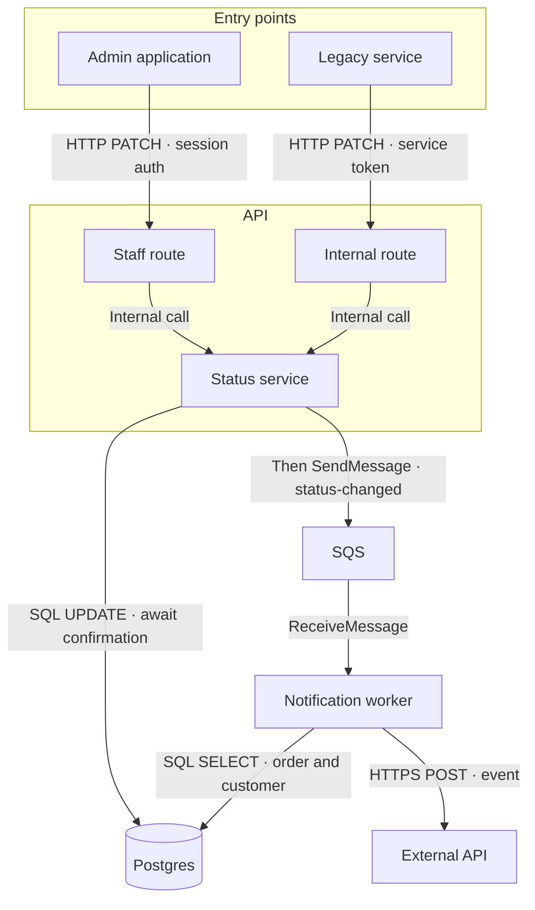

# show-flow

Lead with an architecture diagram, followed by brief explanations in the user's language. Use Mermaid `flowchart` with components as nodes and communications as labeled edges; use a sequence diagram only when explicitly requested.

## 1. Establish the flow

Identify the entry points, outcome, and whether the user wants the current implementation or a proposal. Use the conversation to resolve scope before asking questions.

- **Current implementation:** trace the relevant callers, handlers, queue producers and consumers, database operations, and external integrations in the supplied repositories. Follow each in-scope entry point to the outcome. Distinguish what the code establishes from what requires deployment configuration or runtime evidence.
- **Proposal:** preserve the user's accepted decisions and identify new or changed components. Include only infrastructure needed by that proposal; a diagram request is not a reason to redesign the system.

Before drawing, account for each in-scope origin, component owner, storage dependency, and communication. Mark an unknown connection as unverified or state the gap beside the diagram instead of inventing an endpoint, protocol, or guarantee.

## 2. Draw the architecture

Default to one overall diagram. Group components into shallow subgraphs by responsibility or system boundary, such as origins, API, storage, and background processing. Use `TB` for several layers and `LR` for a short pipeline.

Give each node a concrete system or module name and a short responsibility. Label edges with the mechanism and the essential operation or payload:

- HTTP: method, verified route when useful, and relevant input.
- Database: the querying component points to the database with `SQL SELECT`, `SQL UPDATE`, or the actual storage operation. Add a reverse edge only when the response itself needs explanation, and label it as a query response.
- Queue: producer to queue with `SendMessage` and message type; queue to consumer with `ReceiveMessage` or the actual consumption mechanism. This represents consumption, not an unsolicited push from the queue.
- In-process call: label it as an internal call when it could be mistaken for a network boundary. Multiple routes can converge on one internal service.
- External service: identify the protocol and requested operation.

Keep synchronous confirmation distinct from asynchronous processing. Show transaction boundaries, ordering, retries, or deduplication only where they explain the requested behavior, using verified or explicitly proposed semantics.

Optimize for reading at conversation width: short labels, restrained branching, few crossing edges, and at most two short lines per node where practical. Move secondary details into the prose. Repeating a physical queue or database for readability requires the same resource name on each copy and an explicit note that they are the same resource. Split into smaller views only when requested or when a single view remains unreadable after simplifying it.

Example shape for a proposed flow:

Adapt the shape to the evidence; these technologies and processing steps are illustrative.

## 3. Explain and verify

Follow the diagram with only the details needed to read it: ownership, source of truth, confirmation points, and relevant limitations. For a current flow, link the key implementation files using the host's supported link format. Clearly label proposals and additions.

Check every edge against its caller and receiver. Confirm that database arrows show query initiation, shared resources retain their identity, and each in-scope entry point reaches its actual outcome. Review the Mermaid for valid identifiers, quoted labels, matched subgraphs, and avoidable crossings. Render it when a preview tool is available; otherwise report only checks actually performed if discussing validation.

The explanation is complete when the reader can locate each responsibility and follow the communications from origin to outcome without inferring a missing hop. Deliver the explanation without modifying the system being described unless implementation was separately requested.
